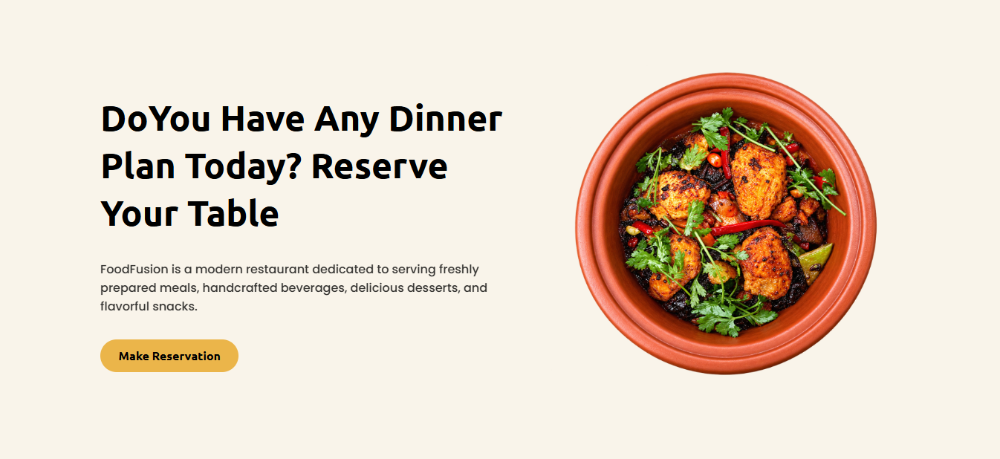
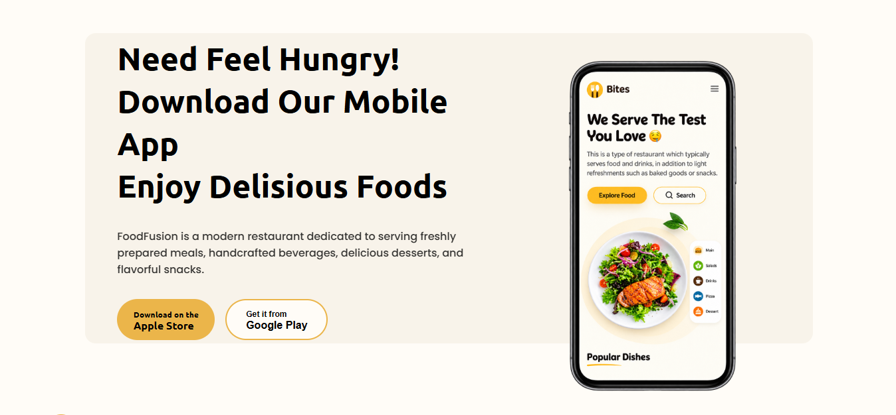
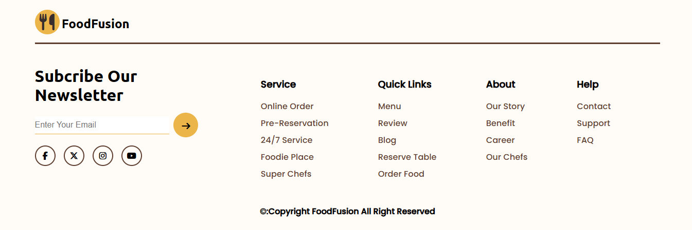

# 🍽️ FoodFusion - Modern Restaurant Landing Page

FoodFusion is a **modern and responsive restaurant landing page** built using **HTML, CSS, and JavaScript**. The project focuses on a clean UI, smooth animations, interactive food sliders, dynamic menu rendering, and a premium restaurant experience.

It is designed as a scalable frontend project and will continue evolving with features like **food search, category filters, add-to-cart functionality, LocalStorage, API integration, and customer testimonials**.

---

## 🚀 Live Preview

🔗 **GitHub Repository:** https://github.com/harishdubeyCS/FoodFusion-Restaurant-Website

---

# 📸 Preview

## 🏠 Hero Section


---

## 🍕 Popular Dishes Section


---

## 👨‍🍳 Services Section


---

## 📅 Reserve Table Section



---

## 📱 Download App Section



---

## 🦶 Footer Section



---

# ✨ Features

### 🎨 Modern UI Design

* Clean restaurant-themed interface
* Soft color palette
* Rounded components
* Smooth hover effects

### 🍽️ Dynamic Food Menu

* Menu cards generated using JavaScript
* Reusable data structure
* Dynamic DOM rendering

### 🖼️ Interactive Hero Slider

* Vertical food category selector
* Active item highlighting
* Main food image switching
* Rotating plate animation

### 🎠 Food Carousel

* Previous/Next navigation
* Smooth horizontal sliding
* Responsive card layout

### 📱 Responsive Layout

* Flexible sections
* Grid and Flexbox based design
* Mobile-friendly structure

### 🎯 Animated Components

* Button hover animations
* Navigation underline effects
* Card interactions
* Image transitions

---

# 🛠️ Tech Stack

| Technology        | Usage                            |
| ----------------- | -------------------------------- |
| HTML5             | Structure                        |
| CSS3              | Styling & Layout                 |
| JavaScript (ES6+) | Dynamic Rendering & Interactions |
| Font Awesome      | Icons                            |
| Google Fonts      | Typography                       |

---

# 📂 Project Structure

```text
FoodFusion/
│
├── index.html
├── README.md
│
├── style/
│   └── style.css
│
├── js/
│   └── js.js
│
├── images/
│   ├── dish.png
│   ├── snack.png
│   ├── platter.png
│   ├── drink.png
│   ├── cake.png
│   ├── chickenBiryani.png
│   ├── pasta.png
│   ├── chef.png
│   ├── Download.png
│   └── ...
│
└── preview/
    ├── hero-section.png
    ├── food-menu.png
    ├── services.png
    ├── reservation.png
    ├── download-app.png
    └── footer.png
```

---

# 💡 JavaScript Functionality

The project currently includes:

* Dynamic food category rendering
* Hero image switching
* Active category selection
* Popular dishes card generation
* Horizontal food slider
* Previous/Next navigation controls

---

# 📌 Upcoming Features (Future Improvements)

The project will be upgraded with the following features:

## 🔍 Food Search

* Search food by name
* Instant filtering
* Real-time results

## 🏷️ Category Filter

* Dishes
* Snacks
* Drinks
* Desserts
* Platters

## 🛒 Shopping Cart

* Add to Cart
* Remove from Cart
* Quantity controls
* Cart total
* Cart sidebar

## 💾 LocalStorage

* Persist cart items
* Save user selections
* Remember favorites
* Maintain cart after page refresh

## ⭐ Dynamic Ratings

* Generate star ratings from data
* Multiple rating support

## 📢 Testimonials Section

* Customer reviews
* Profile images
* Rating display
* Auto slider

## 📱 Mobile Optimization

* Better responsive navigation
* Touch-friendly sliders
* Improved spacing

## 🌐 API Integration

* Fetch food data from API
* Dynamic menu updates
* Loading states
* Error handling

## ❤️ Wishlist System

* Favorite foods
* Wishlist storage
* Heart icon interaction

## 📅 Reservation Form

* Table booking
* Date & time selection
* Guest count
* Validation

## 📈 Performance Improvements

* Lazy loading
* Optimized images
* Modular JavaScript
* Better code organization

---

# 🎯 Learning Highlights

This project demonstrates:

* DOM Manipulation
* Event Handling
* Dynamic Card Rendering
* JavaScript Arrays & Objects
* ES6 Template Literals
* Flexbox & CSS Grid
* CSS Animations
* Responsive Design
* Component-based UI thinking

---

# 🤝 Contributing

Contributions are welcome.

1. Fork the repository
2. Create a new branch
3. Commit your changes
4. Push the branch
5. Open a Pull Request

---

# 📄 License

This project is licensed under the **MIT License**.

---

# 👨‍💻 Author

**Harish Dubey**

Aspiring **Java Full Stack Developer** passionate about creating modern web interfaces and scalable frontend applications.

If you like this project, **give it a ⭐ on GitHub!**
