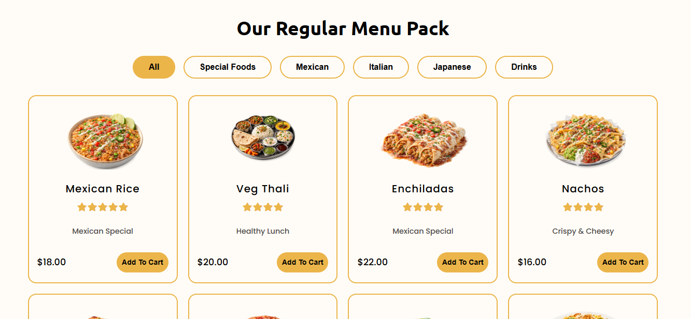

# 🍽️ FoodFusion - Modern Restaurant Landing Page

FoodFusion is a **modern and responsive restaurant landing page** built using **HTML, CSS, and JavaScript (ES6+)**. The project focuses on a clean UI, smooth animations, interactive food sliders, dynamic menu rendering, modular JavaScript architecture, and a premium restaurant experience.

The project uses **ES6 Modules** to organize JavaScript code into reusable components and separate data files. It will continue evolving with features like **food search, category filters, add-to-cart functionality, LocalStorage, API integration, wishlist, and reservation functionality**.

---

## 🚀 Live Preview

🔗 **GitHub Repository:** https://github.com/harishdubeyCS/FoodFusion-Restaurant-Website

---

# 📸 Preview

## 🏠 Hero Section


---

## 🍕 Popular Dishes Section


---

## 👨‍🍳 Services Section


---

## 🍕 Our Food Menu Section



## 📅 Reserve Table Section


---

## 📱 Download App Section


---

## 🦶 Footer Section


---

# ✨ Features

### 🎨 Modern UI Design

* Clean restaurant-themed interface
* Soft color palette
* Rounded components
* Smooth hover effects
* Modern responsive layout

### 🍽️ Dynamic Food Menu

* Food cards generated dynamically using JavaScript
* Reusable food data structure
* Dynamic DOM rendering
* Separate food data files
* Component-based rendering

### 🖼️ Interactive Hero Slider

* Vertical food category selector
* Active item highlighting
* Main food image switching
* Rotating plate animation
* Smooth transitions

### 🎠 Food Carousel

* Previous/Next navigation
* Smooth horizontal sliding
* Responsive card layout
* Interactive navigation controls

### ⭐ Customer Testimonials

* Dynamic testimonial rendering
* Customer profile information
* Rating display
* Testimonial slider
* Separate testimonial data
* Reusable testimonial component

### 📱 Responsive Layout

* Flexible sections
* CSS Grid and Flexbox
* Mobile-friendly structure
* Responsive food cards
* Adaptive layouts

### 🎯 Animated Components

* Button hover animations
* Navigation underline effects
* Card interactions
* Image transitions
* Smooth slider animations

---

# 🛠️ Tech Stack

| Technology        | Usage                            |
| ----------------- | -------------------------------- |
| HTML5             | Website Structure                |
| CSS3              | Styling, Layout & Animations     |
| JavaScript (ES6+) | Dynamic Rendering & Interactions |
| ES6 Modules       | Modular JavaScript Architecture  |
| Font Awesome      | Icons                            |
| Google Fonts      | Typography                       |

---

# 📂 Project Structure

```text
FoodFusion/
│
├── index.html
├── README.md
│
├── style/
│   └── style.css
│
├── js/
│   │
│   ├── component/
│   │   ├── category.js
│   │   ├── circleSlider.js
│   │   ├── foodCards.js
│   │   ├── foodSlider.js
│   │   └── testimonialSlider.js
│   │
│   ├── data/
│   │   ├── categories.js
│   │   ├── filterMenu.js
│   │   ├── foodMenu.js
│   │   ├── foods.js
│   │   └── testimonialData.js
│   │
│   └── main.js
│
├── images/
│   ├── dish.png
│   ├── snack.png
│   ├── platter.png
│   ├── drink.png
│   ├── cake.png
│   ├── chickenBiryani.png
│   ├── pasta.png
│   ├── chef.png
│   ├── Download.png
│   └── ...
│
└── preview/
    ├── preview1.png
    ├── preview2.png
    ├── preview3.png
    ├── preview4.png
    ├── preview5.png
    ├── preview6.png
    ├── preview7.png
    └── preview8.png
```

---

# 💡 JavaScript Functionality

The project uses **ES6 Modules** to keep the JavaScript code clean, reusable, and organized.

### 🧩 Component Modules

The `component` folder contains reusable UI functionality:

* `category.js` - Dynamic food category rendering
* `circleSlider.js` - Hero/category circular slider functionality
* `foodCards.js` - Dynamic food card rendering
* `foodSlider.js` - Food carousel functionality
* `testimonialSlider.js` - Customer testimonial rendering and slider

### 📦 Data Modules

The `data` folder contains reusable application data:

* `categories.js` - Food category data
* `filterMenu.js` - Filter menu data
* `foodMenu.js` - Food menu data
* `foods.js` - Food item data
* `testimonialData.js` - Customer testimonial data

### 🚀 Main JavaScript

`main.js` works as the main entry point of the application and imports the required components using ES6 `import/export`.

The project currently includes:

* Dynamic food category rendering
* Hero image switching
* Active category selection
* Popular dishes card generation
* Horizontal food slider
* Previous/Next navigation controls
* Dynamic testimonial rendering
* Testimonial slider
* Modular JavaScript architecture
* Reusable components
* Separate data and UI logic

---

# 📌 Upcoming Features (Future Improvements)

The project will continue to be upgraded with the following features:

## 🔍 Food Search

* Search food by name
* Instant filtering
* Real-time results

## 🏷️ Category Filter

* Dishes
* Snacks
* Drinks
* Desserts
* Platters
* Dynamic category filtering

## 🛒 Shopping Cart

* Add to Cart
* Remove from Cart
* Quantity controls
* Cart total
* Cart sidebar

## 💾 LocalStorage

* Persist cart items
* Save user selections
* Remember favorites
* Maintain cart after page refresh

## ⭐ Dynamic Ratings

* Generate star ratings from data
* Multiple rating support
* Interactive rating system

## 🌐 API Integration

* Fetch food data from API
* Dynamic menu updates
* Loading states
* Error handling

## ❤️ Wishlist System

* Favorite foods
* Wishlist storage
* Heart icon interaction

## 📅 Reservation Form

* Table booking
* Date & time selection
* Guest count
* Form validation

## 📱 Mobile Optimization

* Better responsive navigation
* Touch-friendly sliders
* Improved spacing
* Mobile interactions

## 📈 Performance Improvements

* Lazy loading
* Optimized images
* Code optimization
* Improved loading performance
* Better error handling

---

# 🎯 Learning Highlights

This project demonstrates:

* DOM Manipulation
* Event Handling
* Dynamic Card Rendering
* JavaScript Arrays & Objects
* ES6 Template Literals
* ES6 Modules
* `import` / `export`
* Modular JavaScript Architecture
* Reusable JavaScript Components
* Separation of Data and UI Logic
* Flexbox & CSS Grid
* CSS Animations
* Responsive Design
* Component-based UI Thinking

---

# 🤝 Contributing

Contributions are welcome.

1. Fork the repository
2. Create a new branch
3. Commit your changes
4. Push the branch
5. Open a Pull Request

---

# 📄 License

This project is licensed under the **MIT License**.

---

# 👨‍💻 Author

**Harish Dubey**

Aspiring **Java Full Stack Developer** passionate about creating modern web interfaces and scalable frontend applications.

If you like this project, **give it a ⭐ on GitHub!**
