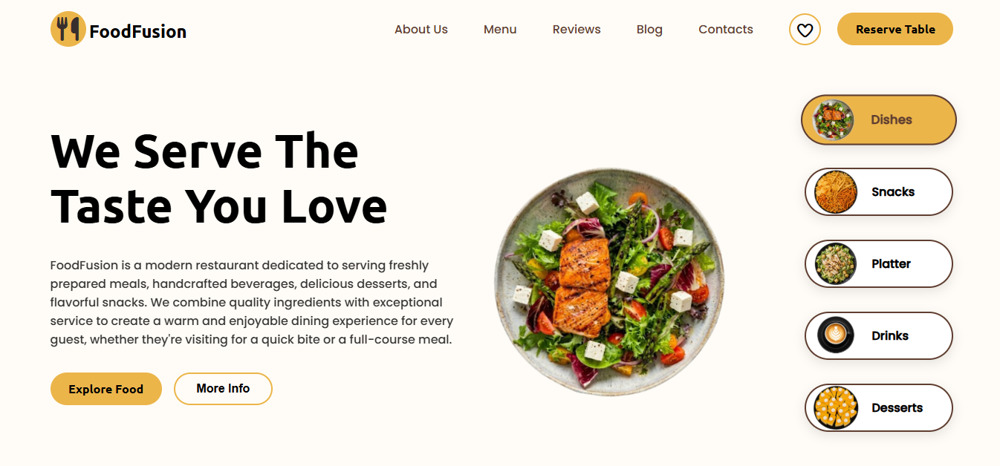
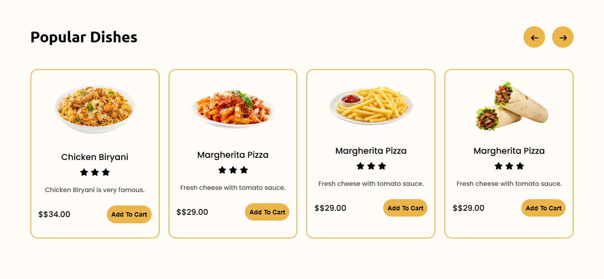
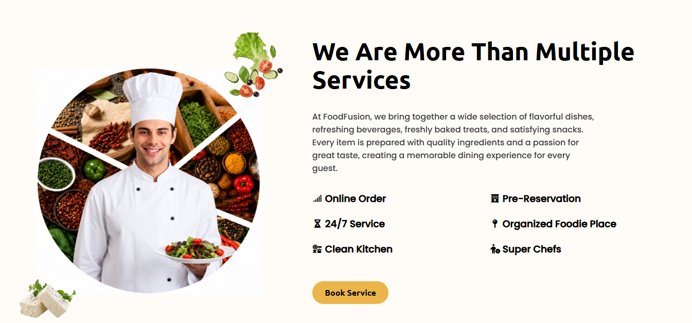

# 🍽️ FoodFusion - Modern Restaurant Landing Page

A modern and responsive **Restaurant Landing Page** built using **HTML, CSS, and JavaScript**. This project showcases an attractive UI with interactive components, smooth animations, and dynamic content rendering using JavaScript.


## 📸 Preview



---



---



## ✨ Features

- 🍔 Dynamic Popular Dishes section generated using JavaScript
- 🍕 Interactive food category slider
- 🍽️ Rotating hero food plate animation
- 🎯 Custom horizontal card slider with navigation arrows
- ⭐ Dynamic star ratings
- 🛒 Add to Cart buttons
- 🎨 Modern UI with hover animations and glass-like card effects
- ⚡ Smooth transitions and animations
- 📱 Responsive layout
- 🧩 Clean and organized code structure

---

## 🛠️ Technologies Used

- HTML5
- CSS3
- JavaScript (ES6)

---

## 📂 Project Structure

```text
FoodFusion/
│
├── index.html
├── README.md
│
├── style/
│   └── style.css
│
├── js/
│   └── js.js
│
├── images/
│   ├── dish.png
│   ├── snack.png
│   ├── platter.png
│   ├── drink.png
│   ├── cake.png
│   ├── chickenBiryani.png
│   ├── pasta.png
│   ├── french fries.png
│   ├── chicken shawarma.png
│   └── ...
│
└── preview/
    └── preview1.png
```

---

## 🎯 What I Learned

- DOM Manipulation
- JavaScript Arrays & Objects
- Dynamic HTML Rendering
- Event Handling
- CSS Flexbox
- CSS Grid
- CSS Animations
- Hover Effects
- Custom Card Slider Logic
- Responsive Web Design

---

## 👨‍💻 Author

**Harish Dubey**

Aspiring Java Full Stack Developer

Currently Learning:

- HTML
- CSS
- JavaScript


>>>>>>> 49f0df3bc66eb9f6154d74302096083e38b14781
---

## ⭐ Support

If you like this project, consider giving it a **⭐ Star** on GitHub.
